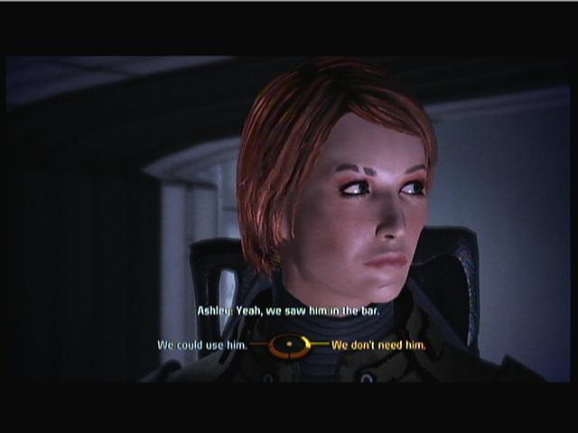

# me2-gibbed-editor-facecode

This is the \`official' internal facecode for my ME/ME2 femshep based
upon cracking the save file with Mass Effect 2 Gibbed Editor.

See http://masseffect.livejournal.com/656484.html

Facial Structure | Internal Property | Float Value / Normal | Direction | Offset from Center
 --- | --- | --- | --- | :---:
Neck Thickness | neck_wide | 0.02000002 / 0.02 | RIGHT | 1
Face Size | shape_skinny | 0.03999998 / 0.02 | LEFT | 2
Cheek Width | cheek_BonesOut | 0.426666737 / 0.0533333 | RIGHT | 8
Cheek Bones | cheek_DepthFront | 0.426666737 / 0.0533333 | RIGHT | 8[1](#footnote1)
Cheek Gaunt | cheek_Gaunt | (0.72 / 0.026667) + 1 | N/A | 28
Ears Size | ears_large | 0.106666707 / 0.02667 | RIGHT | 4
Ears Orientation | ears_out | 0.4 / 0.02667 | RIGHT | 15
Eye Height | eyes_PosDown | 0.0266666543 / 0.0133 | LEFT | 2
Eye Width | eyes_Narrow | 0.05333331 / 0.02667 | LEFT | 2
Eye Depth | eyes_Forward | 0.4 / 0.02667 | RIGHT | 15
Brow Depth | eyes_browBack | 0.4 / 0.06667 | LEFT | 6
Brow Height | eyes_browDown | 0.399999976 / 0.033333 | LEFT | 12
Chin Height | jaw_chinDown | 0.0266666412 / 0.06667 | LEFT | 1
Chin Depth | jaw_chinIn | 0.4 / 0.026667 | LEFT | 15
Chin Width | jaw_chinWide | 0.28 / 0.04 | LEFT | 7[2](#footnote2)
Jaw Width | jaw_wide | 0.2666668 / 0.06667 | RIGHT | 4
Mouth Depth | mouth_back | 0.5866667 / 0.0533333 | LEFT | 11
Mouth Width | mouth_narrow | 0.3 / 0.2 | LEFT | 15
Mouth Lip Size | mouth_lipsThin | 0.266666651 / 0.06667 | LEFT | 4
Mouth Height | mouth_Down | 0.55 / 0.03667 | LEFT | 15
Nose Height | nose_Down | 0.4 / 0.02667 | LEFT | 15
Nose Depth | nose_BottomIn | 0.173333317 / 0.0433 | LEFT | 4

 
<a name="footnote1">[1](#me2-gibbed-editor-facecode)</a>: Article said go \`LEFT' but appears to be wrong.

<a name="footnote2">[2](#me2-gibbed-editor-facecode)</a>: Article says to divide by \`0.06667; think it should be 0.04.

